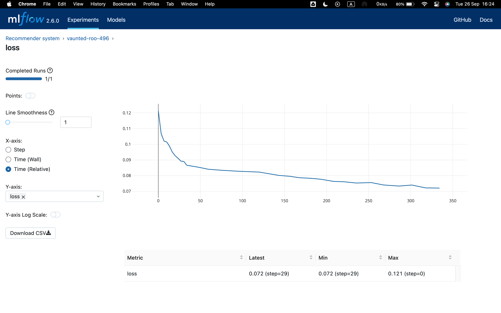

# Content Based Recommender_system


This Recommender System makes use of content based filtering to recommends movies similar to the movie user likes.

The dataset this project was trained on is drived from [MovieLens ml-latest-small](https://grouplens.org/datasets/movielens/latest/).

The original dataset has roughly 9000 movies rated by 600 users with ratings on a scale of 0.5 to 5 in 0.5 step increments. The dataset has been reduced in size to focus on movies from the years since 2000 and popular genres. The reduced dataset has $n_u = 397$ users, $n_m= 847$ movies and 25521 ratings. For each movie, the dataset provides a movie title, release date, and one or more genres.

## How to run the project?

1. Clone or download this repository to your local machine.
2. Install all the libraries mentioned in the requirements.txt file with the command `pip install -r requirements.txt`
3. Build the image 
```bash
docker build -t rec_sys .
```
4. Run the container
```bash
docker run --rm -p 80:80 rec_sys
```
5. Head over to [localhost:80](http://localhost:80) and you should see a message about the server spinning up correctly.
6. Make requests to the server

```json

{
  "user_id": 5,
  "rating_ave": 0.0,
  "action": 5.0,
  "adventure": 0.0,
  "animation": 0.0,
  "childrens": 0.0,
  "comedy": 0.0,
  "crime": 0.0,
  "documentary": 0.0,
  "drama": 0.0,
  "fantasy": 0.0,
  "horror": 0.0,
  "mystery": 0.0,
  "romance": 0.0,
  "scifi": 5.0,
  "thriller": 0.0,
  "rating_count":0

}
```

## Tracking with Mlflow
The recommender system was tracked and monitored with mlflow.



## Deployment
The model was deployed with fastpi and containerized using docker for inference 
